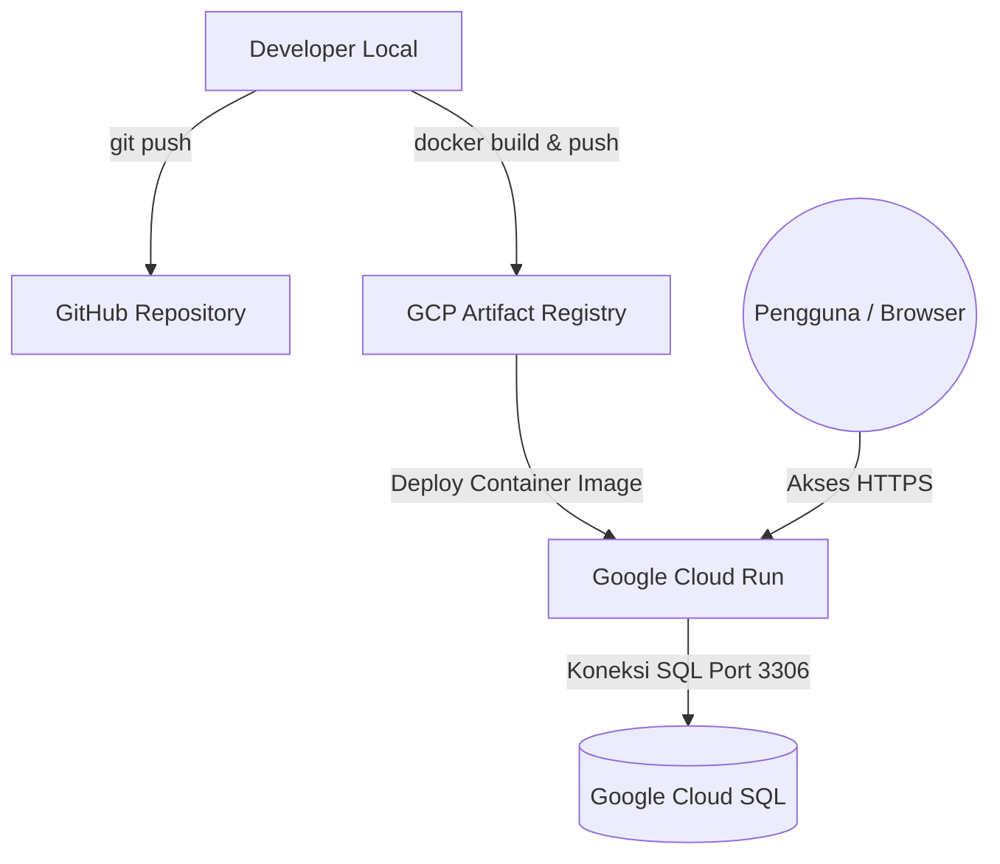

# FacultyWare - Modul Logistik & Inventori (Kelompok B11)

Aplikasi Web **FacultyWare** (Modul Logistik & Inventori FTI UNAND) dikembangkan sebagai bagian dari Tugas Besar mata kuliah **Pemrograman Web** di Departemen Sistem Informasi, Fakultas Teknologi Informasi, Universitas Andalas.

Sistem ini dirancang untuk mendigitalisasi pencatatan stok, mempermudah monitoring persediaan barang secara real-time, menyederhanakan proses stok opname, serta memfasilitasi pelaporan logistik yang akurat bagi pengelola logistik fakultas.

---

## 🚀 Tautan Demo & Deployment
Aplikasi telah dideploy menggunakan infrastruktur cloud dengan containerization Docker:
* **Production URL:** [https://facultyware-2173493146.asia-southeast1.run.app/login](https://facultyware-2173493146.asia-southeast1.run.app/login)
* **Status Infrastruktur:** Google Cloud Run (Serverless) & Google Cloud SQL (MySQL terkelola)
* **Protokol:** HTTPS Terenkripsi (SSL Otomatis)

---

## 👥 Identitas Pengembang (Kelompok B11)
* **Loudysa Azisvi Angelia** (NIM: 2411523024) – *Modul Stok Opname, Riwayat Transaksi & Pelaporan (PDF/Excel)*
* **Dinda Nathasya Putri** (NIM: 2411523032) – *Modul Master Data Barang, Ekspor/Impor Massal & QR Code Generator*

**Dosen Pengampu:** Husnil Kamil, M.T.

---

## 📋 Fitur Utama
1. **Daftar Stok Terkini:** Dashboard monitoring persediaan barang secara real-time.
2. **Melakukan Stok Opname:** Penyesuaian stok fisik secara berkala langsung dari sistem.
3. **Riwayat Transaksi Barang:** Pencatatan otomatis log aktivitas barang masuk, barang keluar, dan opname.
4. **Membuat Laporan Periodik:** Rekapitulasi logistik dengan filter rentang tanggal tertentu.
5. **Ekspor Dokumen ke PDF dan Excel:** Cetak rekapitulasi data ke format dokumen resmi siap pakai.
6. **Memeriksa Riwayat Laporan:** Catatan digital log cetakan laporan yang pernah dibuat di sistem.

---

## 🛠️ Tumpukan Teknologi (Tech Stack)
* **Backend:** Node.js (Express.js)
* **Frontend:** EJS (Embedded JavaScript Templates) & Vanilla CSS / Bootstrap 5
* **Database:** MySQL
* **Testing:** Playwright (End-to-End E2E Testing Framework)
* **Containerization:** Docker
* **Cloud Platform:** Google Cloud Platform (GCP Artifact Registry, Cloud Run, Cloud SQL)

---

## 📐 Arsitektur Deployment
Proses deployment aplikasi ini menggunakan alur otomatis/semi-otomatis terintegrasi:



---

## 💻 Panduan Instalasi Lokal

### 1. Prasyarat (Prerequisites)
Pastikan Anda sudah menginstal:
* [Node.js](https://nodejs.org/) (Rekomendasi versi 18 atau lebih baru)
* [MySQL Server](https://dev.mysql.com/downloads/installer/)

### 2. Kloning Repositori
```bash
git clone https://github.com/loudysaazisvi/B11-Stok-Opname.git
cd B11-Stok-Opname
```

### 3. Instalasi Dependensi
```bash
npm install
```

### 4. Konfigurasi Database
1. Buat database baru bernama `facultyware` di MySQL lokal Anda.
2. Impor berkas SQL schema database yang terletak pada root proyek (misal: `db_tb_pweb_v2 (2).sql` atau file `.sql` terkait) ke database Anda.

### 5. Konfigurasi Environment Variables (`.env`)
Buat file bernama `.env` di direktori root proyek dan isi parameter koneksi database Anda:
```env
DB_HOST=localhost
DB_USER=root
DB_PASSWORD=your_mysql_password
DB_NAME=facultyware
SESSION_SECRET=your_session_secret_key
PORT=3000
```

### 6. Jalankan Aplikasi
Untuk menjalankan dalam mode pengembangan (development):
```bash
npm run dev
# atau jika menggunakan npm start
npm start
```
Buka browser Anda dan akses ke `http://localhost:3000`.

---

## 🧪 Panduan Menjalankan Pengujian (Testing)
Aplikasi ini dilengkapi dengan pengujian fungsional otomatis menggunakan **Playwright** untuk memastikan kestabilan fitur stok opname, transaksi, dan pelaporan.

### 1. Instalasi Playwright Browsers
Sebelum menjalankan tes pertama kali, instal browser mesin Playwright:
```bash
npx playwright install
```

### 2. Menjalankan Pengujian E2E
Pastikan server lokal Anda sedang berjalan (`npm start` di terminal terpisah), lalu jalankan perintah:
```bash
npx playwright test
```

### 3. Melihat Laporan Pengujian
Jika ingin melihat hasil laporan interaktif pasca pengujian:
```bash
npx playwright show-report
```
*Script pengujian utama terletak pada folder `tests/inventory.spec.js`.*
